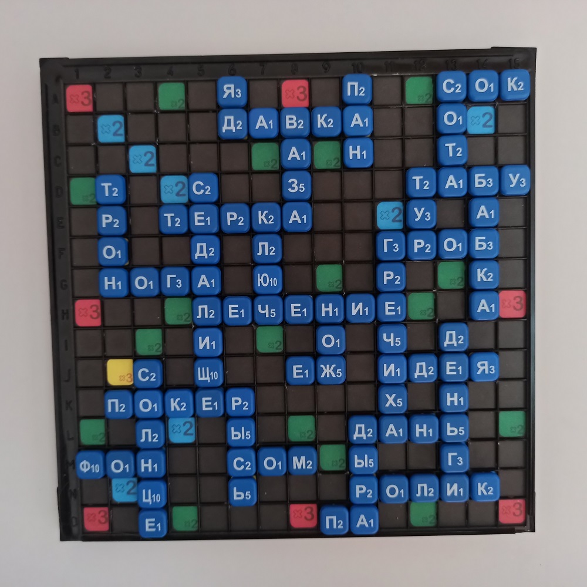
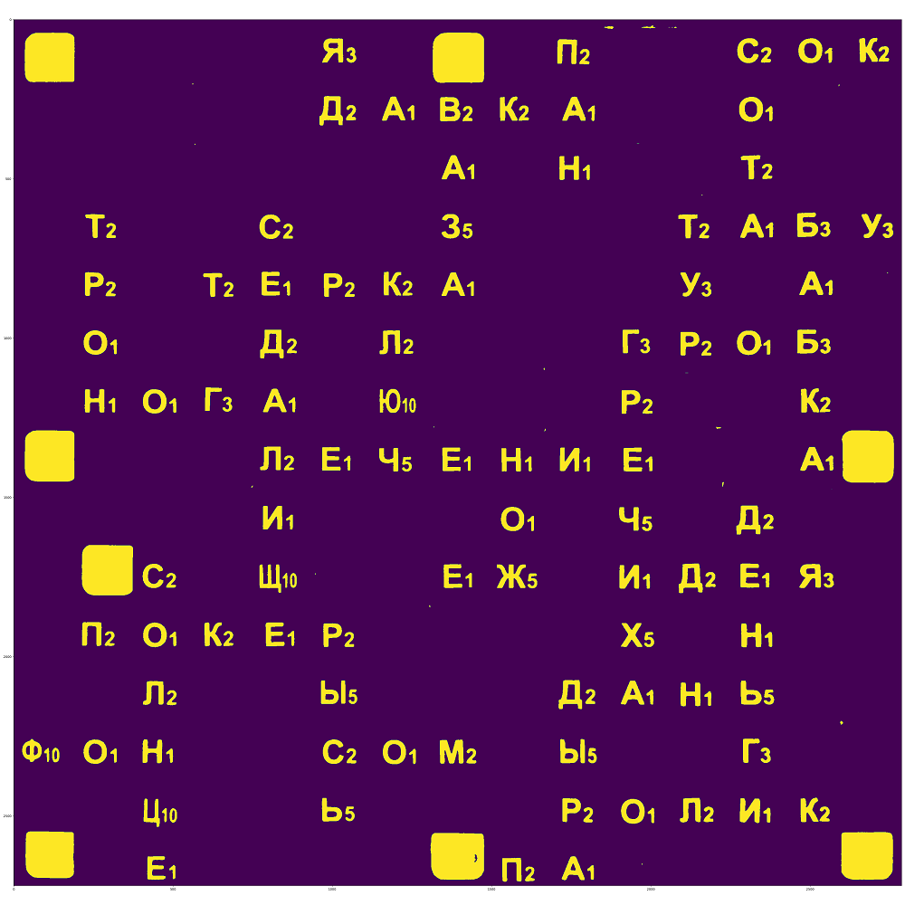
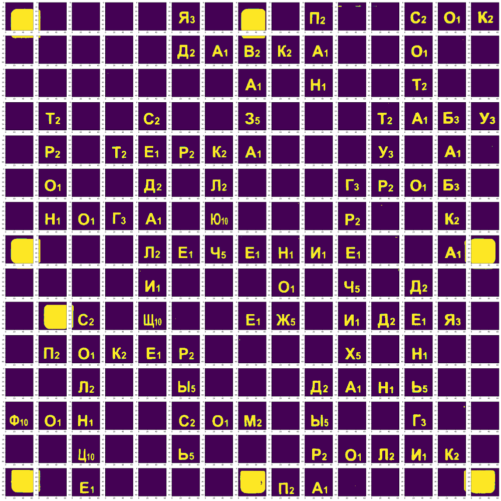
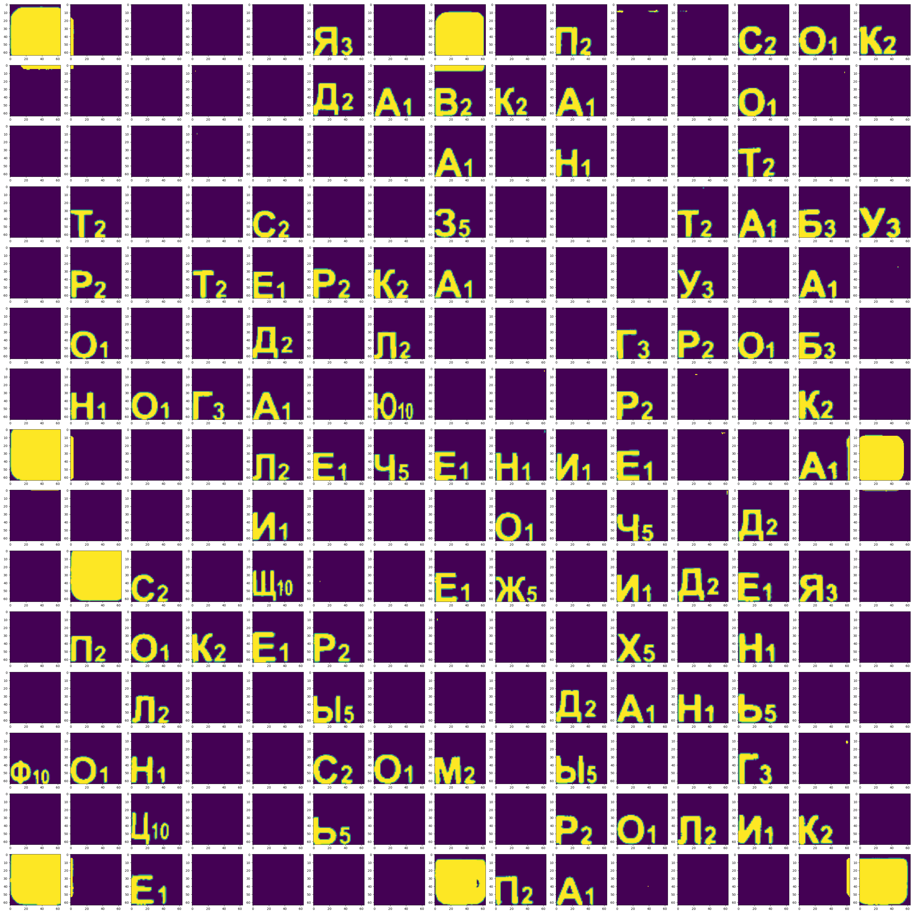

# Что происходит с изображением, когда оно попадает в приложение?

#### 1. Исходное изображене:

#### 2. Корректируем преспективу и вырезаем:

#### 3. Вырезаем игровое поле:

#### 4. Применяем фильтр для перевода в оттенки серого:

#### 5. Убираем шумы, корректируем контраст:

#### 6. Применяем порогование:

#### 7. Нарезаем поле на клетки:

#### 7. Шкалируем размер, положение букв:

#### 8. В таком виде буквы передаются на распознавание в простой классификатор.

