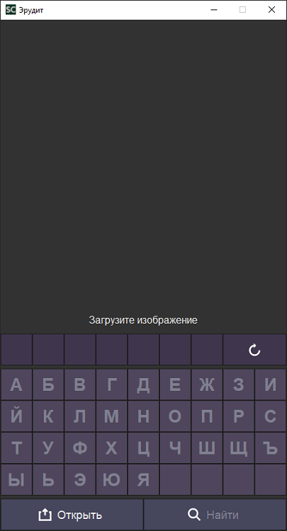
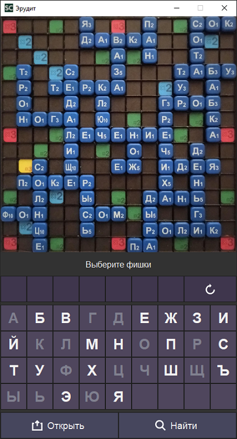
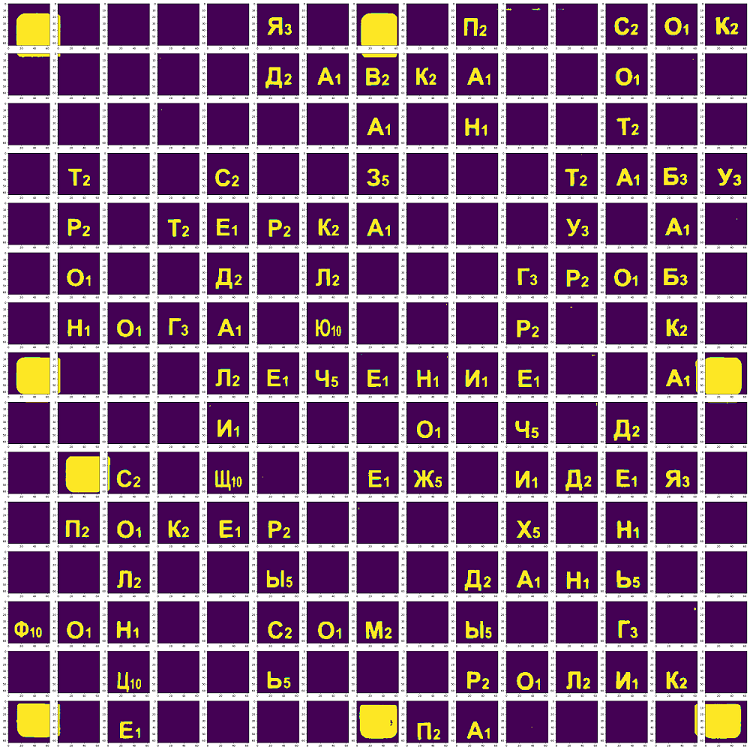
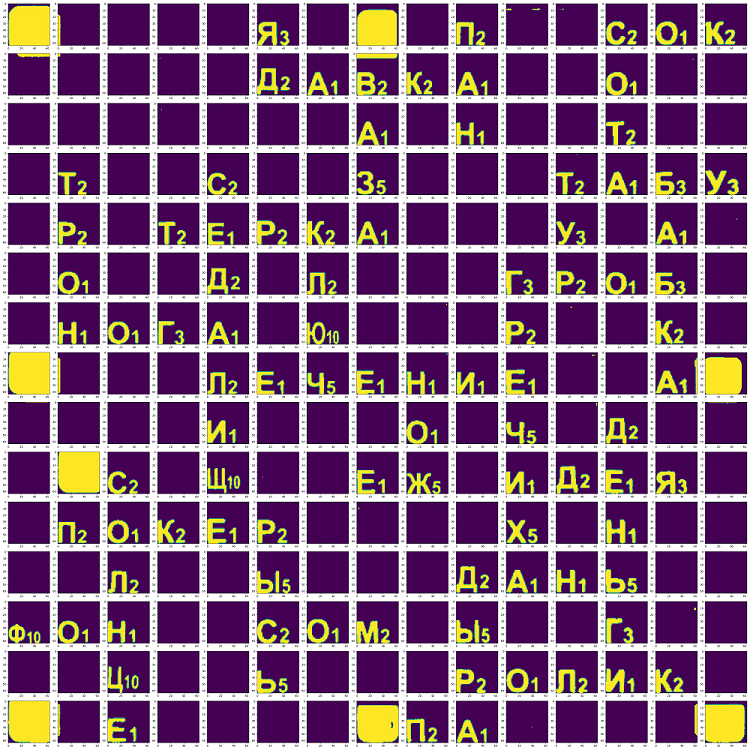

# Пример и принцип работы программы

## Интерфейс

#### 1. Запуск приложения:

#### 2. Загрузка фото:

#### 3. Выбор букв:

#### 4. Результат:

## Что происходит с изображением, когда оно попадает в приложение?

#### 1. Исходное изображене:

#### 2. Вырезка доски по внешнему контуру + коррекция перспективы:

#### 3. Вырезка игрового поля:

#### 4. Применение фильтра:

#### 5. Удаление шумов, коррекция контраста:

#### 6. Применение порога:

#### 7. Нарезка поля на клетки:

#### 8. Шкалировка размера + изменение положения букв:

##### В таком виде буквы передаются на распознавание в простой классификатор.

## Поиск подсказок после классификации

#### 1. Матрица доски после распознавания:

#### 2. Блокировка клеток, на которых невозможно выложить горизонтальное слово:

#### 3. Перебор всех позиций, где можно составить слово.
#### 4. Перебор всех слов из словаря в найденных позициях.
#### 5. Поиск n лучших подсказок (на основании ценности каждой подсказки)

#### 6. Поиск вертикальных подсказок (пункты 2-5 для транспонированной доски)

#### 7. Выбор n лучших непересекающихся подсказок из горизонтальных и вертикальных.

##### Далее подсказки передаются приложению для отображения пользователю
