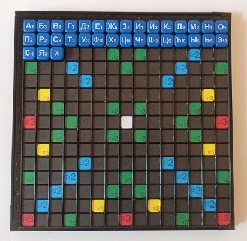

# Scrabble assistant
Распознавание доски и получение подсказок по фотографии в настольной игре Эрудит (Scrabble)

## Необходимые пакеты:
- [Python 3.7.7](https://www.python.org/)
- [numpy 1.18.2](https://numpy.org)
- [PyQt5 5.14.2](https://pypi.org/project/PyQt5/)
- [OpenCV-python 4.2.0.34](https://pypi.org/project/opencv-python/)
- [imageio 2.8.0](https://imageio.readthedocs.io/en/stable/installation.html)
- [Pandas 1.0.3](https://github.com/pandas-dev/pandas/releases)
- [Imutils 0.5.3](https://github.com/jrosebr1/imutils)
- [scikit-image 0.17.2](https://scikit-image.org/)
- [scikit-learn 0.22.2.post1](https://scikit-learn.org/stable/index.html)

Весь список в requirements.txt. Установить одной командой:
```commandline
pip install -r requirements.txt
```
## Что сделано/не сделано

 - Есть:
   + Обрезка доски по внешнему и затем внутреннему контуру
   + Подготовка ячеек доски к дальнейшему использованию
   + Тренировка и распознавание
   + Алгоритм поиска подсказок
   + Приложение для десктопа
 - Нет:
   + Алгоритмы для звёздочки
   + Вывод значений найденных слов
   + Детекцию клеток можно улучшить, если написать ее через 
   подавление оттенка цвета фишки с буквой.
   + Качество букв с бликами можно улучшить, написав выделение цвета с применением PCA.

## Как с этим работать
#### Подготовка датасета (preprocessing/dataset.py)
Для начала необходимо собрать фотографии доски с фишками, 
расставленными по алфавиту следующим образом:  


От количества сделанных фотографий будет зависит качество предсказаний модели.

Далее помещаем эти фотографии в одну папку, указываем путь до неё в 
IMAGES_TO_CUT_PATH и запускаем скрипт. Результат окажется в папке, 
указанной DATASET_PATH. В CV/scan.py IMG_SIZE настраиват 
размер фишек для датасета.

#### Демонстрация обработки изображения:
[Пример](EXAMPLE.md)

#### Тренировка (preprocessing/model.py)
Разархивировать датасет в проект. Сейчас используется путь ../ML/dataset.
Путь указывается в DATASET_PATH, запускаем и ждём результат(до 3 минут).

#### Загрузка нового словаря
Выбор словаря происходит в scrabble_assistant.py DICTIONARY_FILE_PATH
Для нарезки словаря на подсловари разных размеров используется функция нарезки
prepare_frequency_dictionaries() в preprocessing/dictionary.py
В массиве sizes указываются размеры желаемых словарей.
Изначальный словарь со всеми существительными лежит в resources/dictionaries/nouns.txt (13877 слов)

#### Настройка
В приложении имеются параметры для настройки:
1) _hint_amount - кол-во выводимых подсказок (может быть меньше, но не больше указанного значения)
2) _asterisk_active - включение/выключение возможности выбрать фишку * (звездочка)
3) _console_output - включение/выключение вывода информации в консоль

#### Тестирование
Для тестирования подготовлен архив. Он расположен в archives/test_images.rar.

#### Приложение (app.py)
Запускаем приложение, загружаем фотографию доски. Выбираем фишки и жмём "Найти".
Подсказки будут выведены на изображении игрового поля, рядом с ними указана ценность.
